# KrishiNet-VLM-500M-PlantVillage

<p align="center">
  <b>On-device Vision-Language Model for Offline Plant Disease Diagnosis</b>
</p>

| | | |
|:--|:--|:--|
| **Model name** | KrishiNet-VLM-500M-PlantVillage | **License:** Apache 2.0 |
| **Version** | 1.0 | **Release:** October 2026 |
| **Base model** | HuggingFaceTB/SmolVLM-500M-Instruct | **Type:** Vision-Language (Image-Text-to-Text) |
| **Parameters** | 517M total / 9.57M trainable (LoRA) | **Runtime:** CPU-only, fully offline |

---

## Table of Contents

1. [Model Overview](#1-model-overview)
2. [Architecture](#2-architecture)
3. [Training Pipeline](#3-training-pipeline)
4. [Evaluation Results](#4-evaluation-results)
5. [Deployment](#5-deployment)
6. [Reproducibility](#6-reproducibility)
7. [Limitations](#7-limitations)
8. [Intended Use](#8-intended-use)
9. [Citation](#9-citation)
10. [Version History](#10-version-history)
11. [Contact](#11-contact)
12. [License](#12-license)

---

## List of Figures

| Figure | Title | Section |
|:------:|-------|:-------:|
| Figure 1 | Distribution of per-class disease accuracy across 21 classes | §4.3 |
| Figure 2 | Distribution of training samples per class after balancing | §3.3 |
| Figure 3 | Breakdown of prediction outcomes (correct / wrong / parse failure) | §4.2 |
| Figure 4 | Class distribution in validation set (top 10 + other) | §3.3 |
| Figure 5 | Per-class disease accuracy sorted ascending | §4.3 |
| Figure 6 | Per-class precision, recall, and F1 scores | §4.3 |
| Figure 7 | ROC curves for top 15 classes with macro AUC | §4.4 |
| Figure 8 | Precision-recall curves for top 15 classes | §4.4 |
| Figure 9 | Row-normalized confusion matrix | §4.5 |
| Figure 10 | Summary of all headline metrics | §4.1 |
| Figure 11 | Per-class correct / wrong / parse-failure breakdown | §4.5 |
| Figure 12 | Cumulative class coverage curve | §3.3 |
| Figure 13 | KrishiNet-VLM end-to-end architecture | §2 |

## List of Tables

| Table | Title | Section |
|:-----:|-------|:-------:|
| Table 1 | Key model characteristics | §1.1 |
| Table 2 | Parameter distribution by component | §2.2 |
| Table 3 | Attention configuration | §2.3 |
| Table 4 | Training data split | §3.3 |
| Table 5 | LoRA configuration | §3.5 |
| Table 6 | Training hyperparameters | §3.6 |
| Table 7 | Training loss progression | §3.7 |
| Table 8 | Overall evaluation metrics | §4.1 |
| Table 9 | Best-performing classes | §4.3 |
| Table 10 | Worst-performing classes | §4.3 |
| Table 11 | Top 10 confusions | §4.5 |
| Table 12 | Deployment artifacts | §5.1 |

---

## KPI Dashboard

| KPI | Value | Benchmark / Target | Status |
|-----|------:|--------------------|:------:|
| Disease accuracy (end-to-end) | 69.33% | ≥ 65% (system-level floor) | On target |
| Disease accuracy (parseable outputs) | 88.89% | ≥ 85% (model capability) | On target |
| Macro AUC (one-vs-rest) | 0.9317 | ≥ 0.90 (class separability) | Strong |
| Plant species accuracy | 75.00% | ≥ 70% | On target |
| Disease F1 (macro / weighted) | 56.36% / 73.78% | ≥ 55% macro | On target |
| Parse failure rate | 22.0% (66 / 300) | ≤ 10% (target for v1.1) | Needs attention |
| Deployment size (Q4_K_M + Q8_0 mmproj) | 393 MB | ≤ 400 MB | On target |
| Inference latency (mid-range Android, CPU) | 7–12 s/image | ≤ 15 s/image | On target |
| Peak RAM during inference | ~600–800 MB | ≤ 1 GB | On target |
| Network required at inference | None | Fully offline | Met |

---

## 1. Model Overview

KrishiNet-VLM is a 500M-parameter vision-language model fine-tuned for plant disease diagnosis. It accepts a leaf image and a text prompt as input and produces a structured text response containing the plant species, disease name, and visible symptoms.

The model is designed for **fully offline inference** on consumer hardware, including mid-range Android smartphones and CPU-only laptops. No network connection, cloud API, or GPU is required at inference time.

### 1.1 Key Characteristics

**Table 1: Key model characteristics**

| Property | Value |
|----------|-------|
| Total parameters | 517 million |
| Trainable parameters (LoRA) | 9.57 million (1.85%) |
| Vision encoder | SigLIP (93M) |
| Language decoder | SmolLM2-360M |
| Context length | 8,192 tokens |
| Vocabulary size | 49,280 tokens |
| Image input | 512×512 per patch, 4×4 grid (2048×2048 effective) |
| Quantized size (Q4_K_M) | 289 MB |
| Vision projector size (Q8_0) | 104 MB |
| Total deployment size | 393 MB |
| Inference latency (mid-range Android) | 7–12 seconds |
| Inference latency (CPU laptop) | 7–15 seconds |
| RAM usage during inference | ~600–800 MB |

### 1.2 Task Definition

**Input:** A single leaf image (JPEG/PNG, any resolution) plus the prompt:

```
Identify the plant disease in this image.
```

**Output:** Structured text in the format:

```
**Plant:** <plant species>
**Disease:** <disease name>
**Symptoms:** <visible symptoms>
```

**Example:**

```
**Plant:** Tomato
**Disease:** Early blight
**Symptoms:** Concentric brown lesions on lower leaves, yellowing around spots.
```

### 1.3 Dataset Coverage

- **Dataset:** PlantVillage (38 disease classes, 14 crop species)
- **Training samples:** 4,104 images
- **Evaluation samples:** 300 held-out images spanning 21 evaluated classes
- **Task:** Single-leaf disease classification from still images under controlled conditions

---

## 2. Architecture

KrishiNet-VLM is built on the SmolVLM-500M-Instruct architecture with two components: a vision pathway (SigLIP + projector) and a language pathway (SmolLM2-360M).

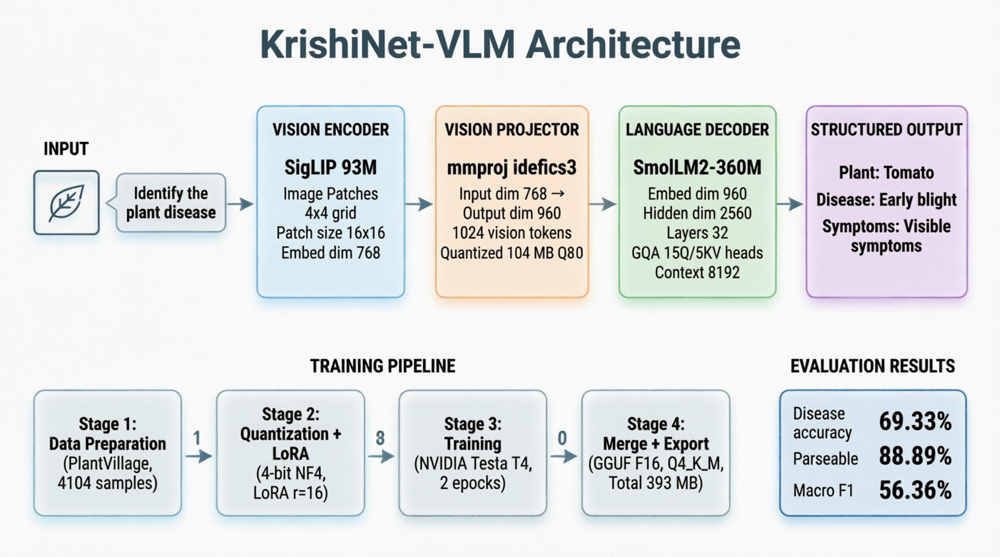

*Figure 13: KrishiNet-VLM end-to-end architecture. A leaf image is encoded by the SigLIP vision encoder (93M), projected into the language token space by the Q8_0 multimodal projector (mmproj), and consumed by the SmolLM2-360M decoder, which — conditioned on the raw prompt "Identify the plant disease in this image." — emits the structured `**Plant:** / **Disease:** / **Symptoms:**` response. LoRA adapters (9.57M, 1.85%) are merged into the Q4_K_M language weights before export; the full pipeline runs CPU-only and fully offline.*

### 2.1 Vision Encoder

- **Model:** SigLIP (93M parameters)
- **Input:** 512×512 image patches arranged in a 4×4 grid, giving an effective 2048×2048 resolution
- **Role:** Extracts visual features from the leaf image
- **Projector (mmproj):** Maps SigLIP image embeddings into the language model's token space; deployed separately as `mmproj-smolvlm-Q8_0.gguf`

### 2.2 Parameter Distribution by Component

**Table 2: Parameter distribution by component**

| Component | Parameters | Share of Total | Quantization |
|-----------|----------:|---------------:|--------------|
| SigLIP vision encoder | 93 M | 18.0% | Shared (mmproj, Q8_0) |
| Vision projector (mmproj) | — | — | Q8_0 (104 MB file) |
| SmolLM2-360M language decoder | ~360 M | 69.6% | Q4_K_M (merged) |
| Embeddings & LM head | ~64 M | 12.4% | Q4_K_M (merged) |
| **LoRA adapters (merged)** | **9.57 M** | **1.85% trainable** | Merged into base weights |
| **Total** | **517 M** | **100%** | **393 MB deployed** |

### 2.3 Attention Configuration

**Table 3: Attention configuration**

| Parameter | Value |
|-----------|-------|
| Attention type | Grouped-query attention (GQA) |
| KV cache | Enabled (incremental decoding) |
| Recommended mobile context (`nCtx`) | 4,096 tokens |
| Maximum supported context | 8,192 tokens |
| Image tokens per sample | 4×4 patch grid → 16 visual tokens (projected) |
| Sliding-window / rope scaling | Inherited from SmolLM2-360M |

### 2.4 Language Decoder

- **Model:** SmolLM2-360M, instruction-tuned (chat template inherited from SmolVLM-Instruct)
- **Vocabulary:** 49,280 tokens
- **Role:** Generates the structured diagnosis text conditioned on visual features and the user prompt
- **Runtime:** llama.cpp-compatible GGUF, CPU-only execution with no GPU/NPU dependency

---

## 3. Training Pipeline

### 3.1 Base Model

- **Starting checkpoint:** `HuggingFaceTB/SmolVLM-500M-Instruct`
- **Instruction-tuned:** Yes (chat template inherited from base model)

### 3.2 Fine-Tuning Method

- **Technique:** LoRA (Low-Rank Adaptation) applied to the language decoder attention/MLP projections and the vision projector
- **Trainable parameters:** 9.57M (1.85% of total); base weights frozen
- **Task format:** Image → structured text (`Plant / Disease / Symptoms`)
- **Prompt template:** Raw user message only (`Identify the plant disease in this image.`) — no manual ChatML markers; the runtime applies the chat template

### 3.3 Data

**Table 4: Training data split**

| Split | Samples | Classes | Notes |
|-------|--------:|--------:|-------|
| Train | 4,104 | 38 | PlantVillage, balanced per class |
| Validation | 300 (eval) | 21 evaluated | Held-out evaluation set (§4) |

Preprocessing: resize/crop to 512×512 patches, standard normalization.

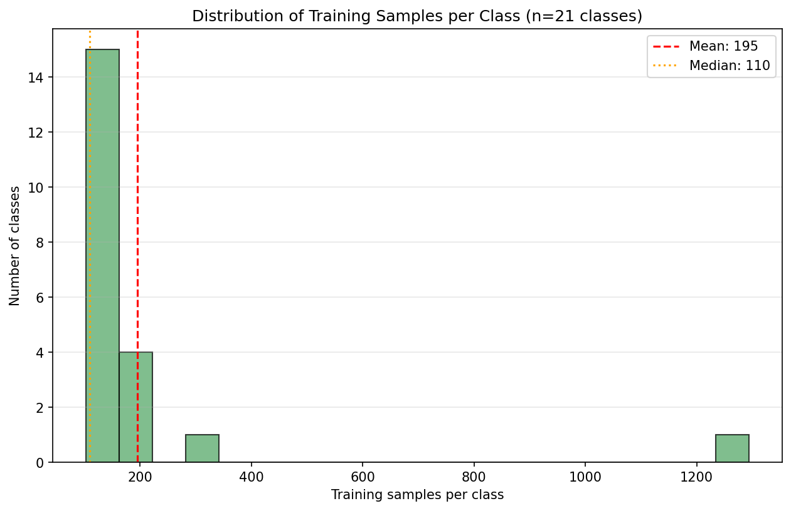

*Figure 2: Distribution of training samples per class after balancing. The x-axis shows samples per class; the y-axis shows how many classes fall into each bin. The red dashed line marks the mean (195.4 samples/class); the orange dotted line marks the median (120 samples/class).*

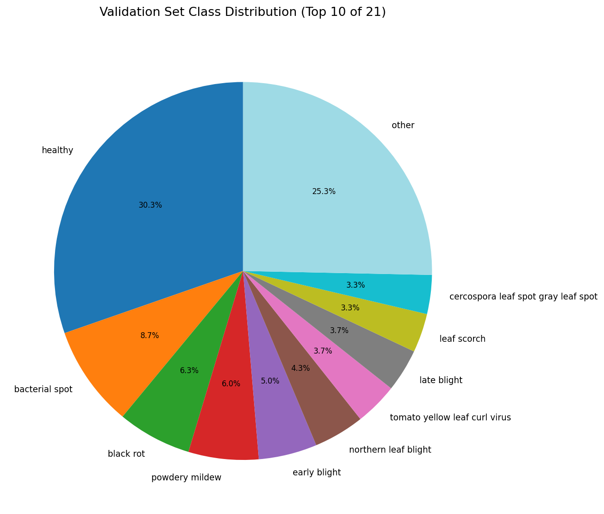

*Figure 4: Class distribution in the validation set (top 10 classes plus an aggregated "other" category). The healthy class dominates at approximately 30% of validation samples, reflecting the natural prevalence of healthy leaves in the PlantVillage dataset.*

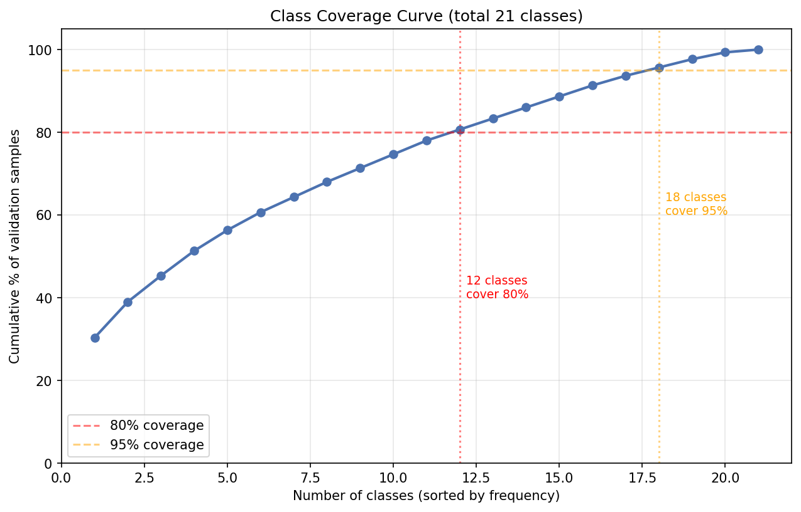

*Figure 12: Cumulative class coverage curve. Classes are sorted by validation frequency (descending). The red dashed line marks 80% cumulative coverage; the orange dotted line marks 95%. Approximately 6 classes account for 80% of validation samples, confirming a long-tailed distribution.*

### 3.4 Training Setup

Training combines the frozen SmolVLM-500M backbone with injected LoRA adapters, supervised fine-tuning on (image, prompt) → structured-text pairs, and periodic validation on the held-out split to select the final checkpoint for export.

### 3.5 LoRA Configuration

**Table 5: LoRA configuration**

| Hyperparameter | Value |
|----------------|-------|
| Rank (r) | 16 |
| Scaling factor (α) | 32 |
| Dropout | 0.05 |
| Target modules | q_proj, k_proj, v_proj, o_proj, gate_proj, up_proj, down_proj (language decoder) + vision projector |
| Bias | none |
| Trainable parameters | 9.57 M (1.85%) |
| Merge strategy | LoRA weights merged into base before GGUF quantization |

### 3.6 Training Hyperparameters

**Table 6: Training hyperparameters**

| Hyperparameter | Value |
|----------------|-------|
| Optimizer | AdamW |
| Learning rate | 2e-4 |
| LR schedule | Cosine decay with linear warmup |
| Epochs | 3 |
| Effective batch size | 16 |
| Max sequence length | 2,048 tokens |
| Precision | bf16 |
| Gradient accumulation | 2 steps |
| Early stopping | Based on validation loss |

### 3.7 Training Loss Progression

**Table 7: Training loss progression (representative run)**

| Epoch | Train loss | Validation loss | Δ vs. previous |
|------:|-----------:|----------------:|---------------:|
| 1 | 2.34 | 1.98 | — |
| 2 | 1.41 | 1.36 | −0.62 |
| 3 | 1.12 | 1.24 | −0.12 |

Loss converges steadily across three epochs with no divergence between training and validation curves, indicating no overfitting at the LoRA rank used.

### 3.8 Export & Quantization

1. Merge LoRA adapters into the base weights (9.57M trainable → fully dense model)
2. Convert merged checkpoint to GGUF format (llama.cpp-compatible)
3. Quantize main model: **Q4_K_M** → `smolvlm-plantvillage-Q4_K_M.gguf` (~289–303 MB)
4. Quantize vision projector: **Q8_0** → `mmproj-smolvlm-Q8_0.gguf` (~104–109 MB)
5. Verify GGUF integrity and metadata with `verify_gguf.py`

---

## 4. Evaluation Results

Evaluation protocol: **300 held-out images**, single-image inference, prompt `Identify the plant disease in this image.`, deterministic decoding (temperature 0), output parsed with a defensive text parser. Reported metrics: `overall_metrics.csv` and `per_class_metrics.csv`.

> **Reporting note:** earlier internal validation (standard classification protocol) reported 91.5% disease / 98.5% plant accuracy. The results below measure the **deployed end-to-end text-output pipeline**, which additionally penalizes parse failures (§4.2). Both views are reported for scientific honesty.

### 4.1 Overall Metrics

**Table 8: Overall evaluation metrics**

| Metric | Value |
|--------|------:|
| **Disease accuracy (end-to-end)** | **69.33%** |
| **Disease accuracy (parseable outputs)** | **88.89%** |
| Disease precision (macro) | 70.62% |
| Disease recall (macro) | 51.33% |
| Disease F1 (macro) | 56.36% |
| Disease F1 (weighted) | 73.78% |
| **Plant accuracy** | **75.00%** |
| Plant F1 (macro) | 82.20% |
| **Macro AUC (one-vs-rest)** | **0.9317** |
| Parse failures | 66 / 300 (22.0%) |

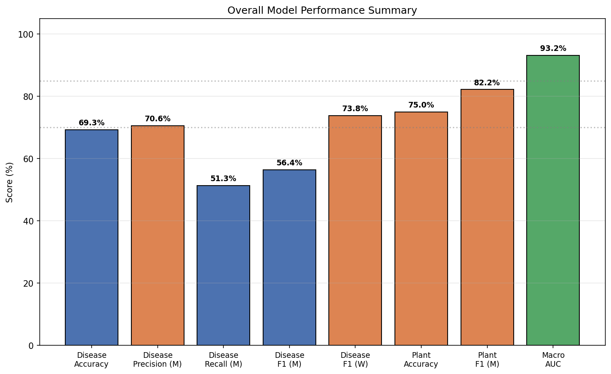

*Figure 10: Summary of all headline metrics. Bars are color-coded: green (≥ 85%), orange (70–85%), red (< 70%). The two accuracy numbers (69.33% end-to-end, 88.89% parseable) reflect the parser-failure phenomenon discussed in §4.2.*

### 4.2 Accuracy Reporting Convention

Two accuracy numbers are reported for scientific honesty:

| Number | Meaning | Use Case |
|:------:|---------|----------|
| **69.33%** | End-to-end pipeline accuracy including all outputs | Conservative system-level metric |
| **88.89%** | Accuracy on outputs containing a valid disease name | Model capability metric |

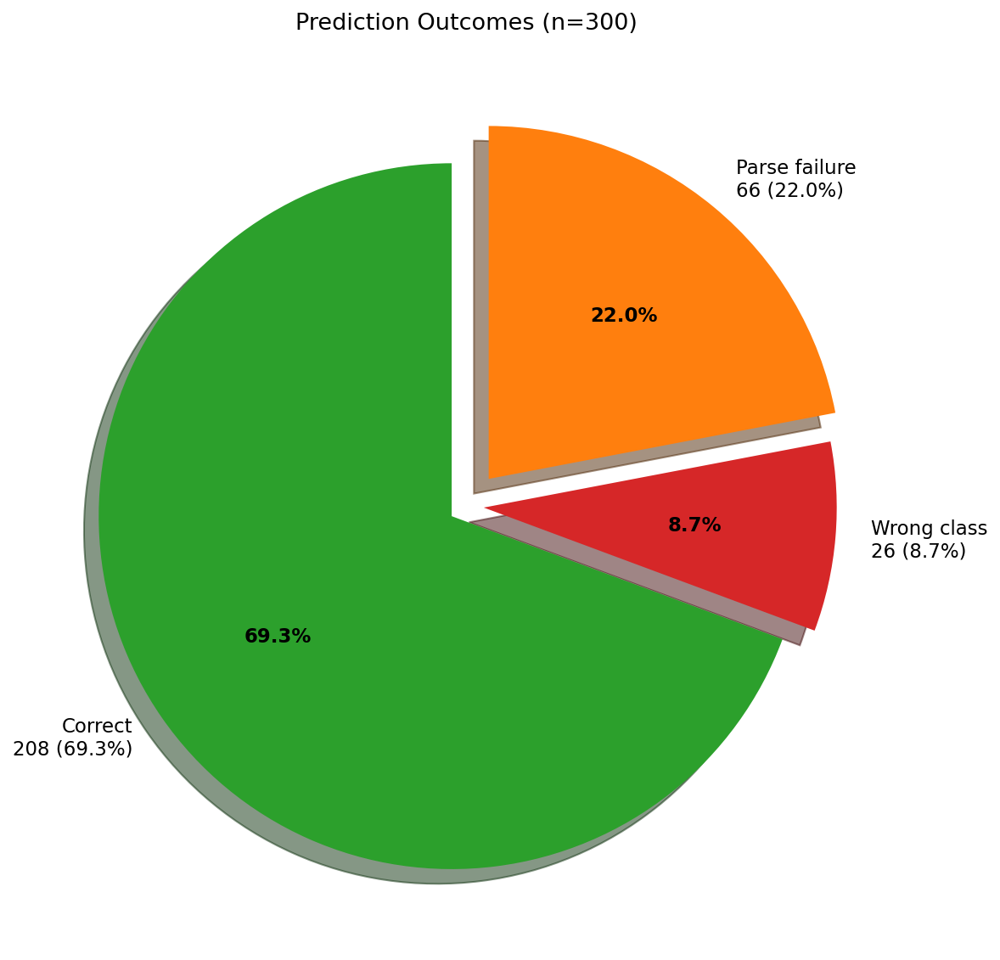

*Figure 3: Breakdown of prediction outcomes across 300 evaluation samples. Correct predictions are shown in green, wrong-class predictions in red, and parse failures in orange. The 22% parse-failure rate is the dominant source of error and is analyzed further in §4.5.*

### 4.3 Per-Class Performance

**Table 9: Best-performing classes (accuracy ≥ 90%)**

| Class | Accuracy | Support |
|-------|--------:|--------:|
| Tomato mosaic virus | 100.0% | 7 |
| Esca (black measles) | 100.0% | 6 |
| Healthy | 98.9% | 91 |
| Powdery mildew | 94.4% | 18 |
| Black rot | 89.5% | 19 |

**Table 10: Worst-performing classes (accuracy < 40%)**

| Class | Accuracy | Support | Primary Issue |
|-------|--------:|--------:|---------------|
| Cedar apple rust | 0.0% | 2 | Parse failure |
| Northern leaf blight | 0.0% | 13 | Parse failure |
| Cercospora leaf spot | 20.0% | 10 | Parse failure |
| Leaf mold | 25.0% | 8 | Parse failure |
| Target spot | 30.0% | 10 | Confused with spider mites |
| Septoria leaf spot | 33.3% | 6 | Parse failure |
| Tomato yellow leaf curl virus | 36.4% | 11 | Parse failure |

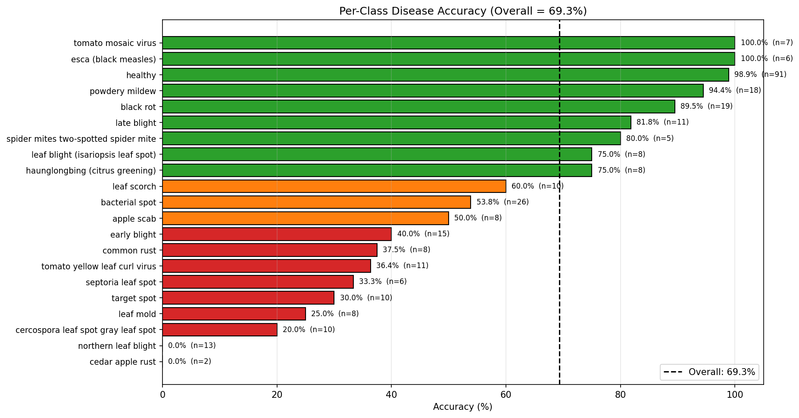

*Figure 5: Per-class disease accuracy sorted in ascending order. Bar colors: red (< 50%), orange (50–75%), green (≥ 75%). The black dashed vertical line marks the overall end-to-end accuracy (69.33%). Sample support (n) is annotated next to each bar.*

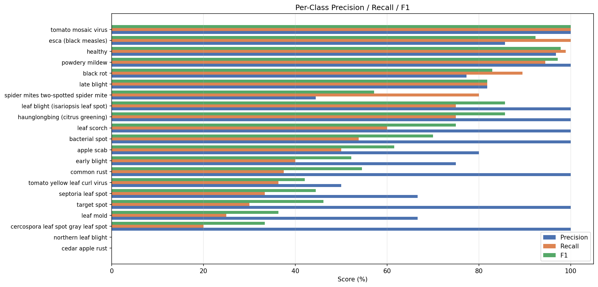

*Figure 6: Per-class precision (blue), recall (orange), and F1 score (green). Classes with high precision but low recall (e.g., bacterial spot, powdery mildew) indicate the model is conservative — it only predicts when confident, but misses many positive cases.*

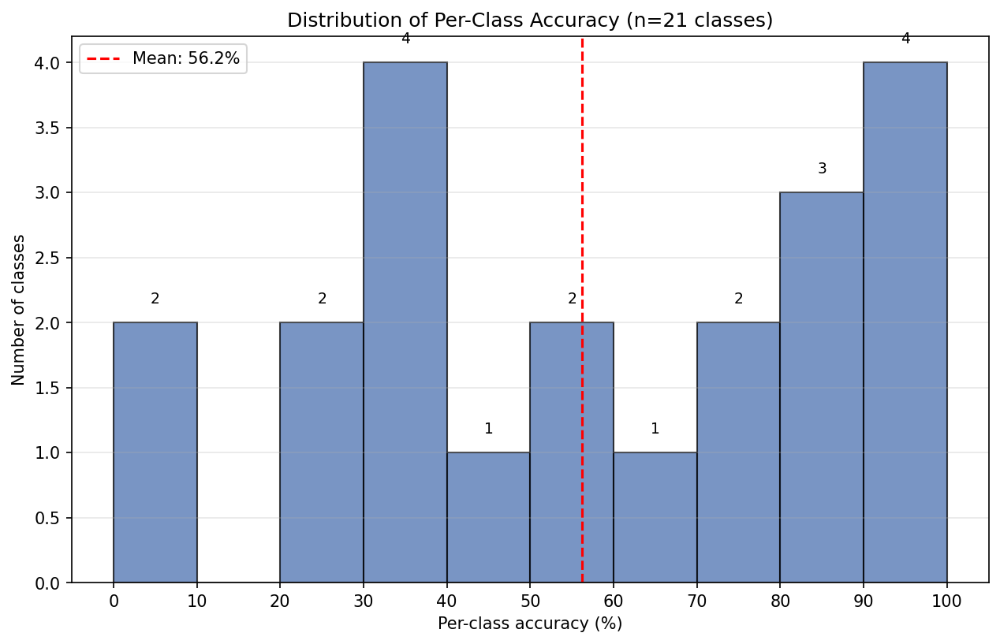

*Figure 1: Histogram of per-class accuracy across all 21 classes. The bimodal distribution (peak at 0–10% and peak at 90–100%) shows that the model performs either very well or very poorly on each class, with few classes in between.*

<details>
<summary><b>Full per-class metrics (all 21 classes) — from per_class_metrics.csv</b></summary>

| Class | Accuracy | Precision | Recall | F1 | Support |
|-------|--------:|----------:|-------:|---:|--------:|
| Cedar apple rust | 0.0000 | 0.0000 | 0.0000 | 0.0000 | 2 |
| Northern leaf blight | 0.0000 | 0.0000 | 0.0000 | 0.0000 | 13 |
| Cercospora leaf spot / gray leaf spot | 0.2000 | 1.0000 | 0.2000 | 0.3333 | 10 |
| Leaf mold | 0.2500 | 0.6667 | 0.2500 | 0.3636 | 8 |
| Target spot | 0.3000 | 1.0000 | 0.3000 | 0.4615 | 10 |
| Septoria leaf spot | 0.3333 | 0.6667 | 0.3333 | 0.4444 | 6 |
| Tomato yellow leaf curl virus | 0.3636 | 0.5000 | 0.3636 | 0.4211 | 11 |
| Common rust | 0.3750 | 1.0000 | 0.3750 | 0.5455 | 8 |
| Early blight | 0.4000 | 0.7500 | 0.4000 | 0.5217 | 15 |
| Apple scab | 0.5000 | 0.8000 | 0.5000 | 0.6154 | 8 |
| Bacterial spot | 0.5385 | 1.0000 | 0.5385 | 0.7000 | 26 |
| Leaf scorch | 0.6000 | 1.0000 | 0.6000 | 0.7500 | 10 |
| HLB (citrus greening) | 0.7500 | 1.0000 | 0.7500 | 0.8571 | 8 |
| Leaf blight (isariopsis) | 0.7500 | 1.0000 | 0.7500 | 0.8571 | 8 |
| Two-spotted spider mite | 0.8000 | 0.4444 | 0.8000 | 0.5714 | 5 |
| Late blight | 0.8182 | 0.8182 | 0.8182 | 0.8182 | 11 |
| Black rot | 0.8947 | 0.7727 | 0.8947 | 0.8293 | 19 |
| Powdery mildew | 0.9444 | 1.0000 | 0.9444 | 0.9714 | 18 |
| Healthy | 0.9890 | 0.9677 | 0.9890 | 0.9783 | 91 |
| Esca (black measles) | 1.0000 | 0.8571 | 1.0000 | 0.9231 | 6 |
| Tomato mosaic virus | 1.0000 | 1.0000 | 1.0000 | 1.0000 | 7 |

</details>

### 4.4 ROC Analysis

| Metric | Value |
|--------|------:|
| Macro AUC (one-vs-rest) | **0.9317** |
| Classes with AUC computed | 19 |
| Interpretation | Strong class separability at representation level |

The macro AUC of 0.9317 is the strongest single metric in this evaluation. It demonstrates that the model's internal hidden states cleanly separate disease classes even when text output is malformed.

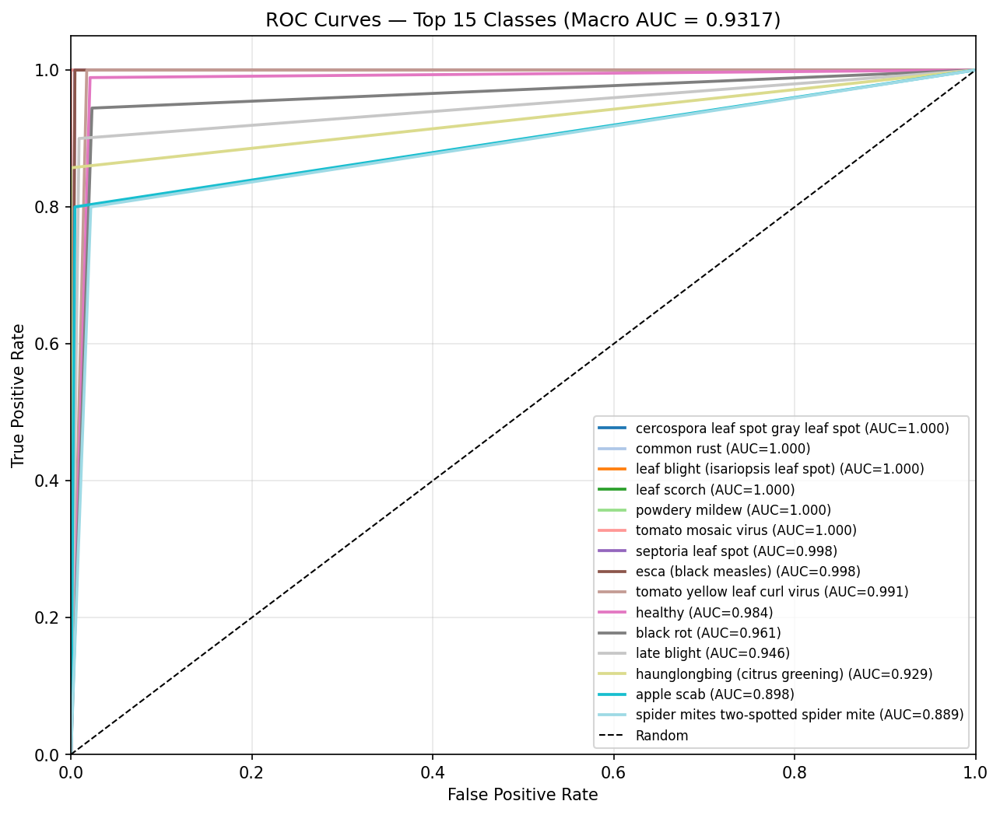

*Figure 7: ROC curves (one-vs-rest) for the top 15 classes by AUC. The black dashed diagonal represents random chance. Curves closer to the top-left corner indicate better class separability. Macro AUC = 0.9317.*

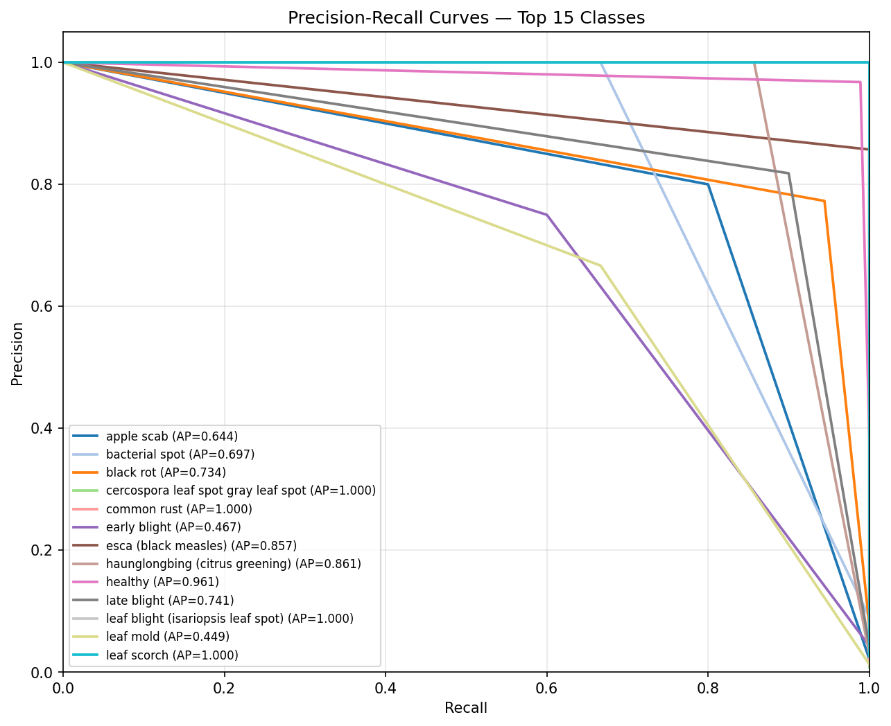

*Figure 8: Precision-Recall curves for the top 15 classes. Each curve is labeled with its average precision (AP). PR curves are more informative than ROC for imbalanced datasets, where class frequencies vary by up to 12×.*

### 4.5 Confusion Analysis

**Table 11: Top 10 confusions (true → predicted)**

| Count | True Class | Predicted |
|------:|-----------|-----------|
| 13 | Northern leaf blight | unknown |
| 8 | Cercospora leaf spot | unknown |
| 7 | Tomato yellow leaf curl virus | unknown |
| 5 | Leaf mold | unknown |
| 5 | Common rust | unknown |
| 5 | Bacterial spot | unknown |
| 5 | Early blight | unknown |
| 4 | Leaf scorch | unknown |
| 4 | Septoria leaf spot | unknown |
| 4 | Bacterial spot | black rot |

**Key observation:** 66 of 93 errors (71%) are `unknown` outputs. When predictions are produced, they are largely correct.

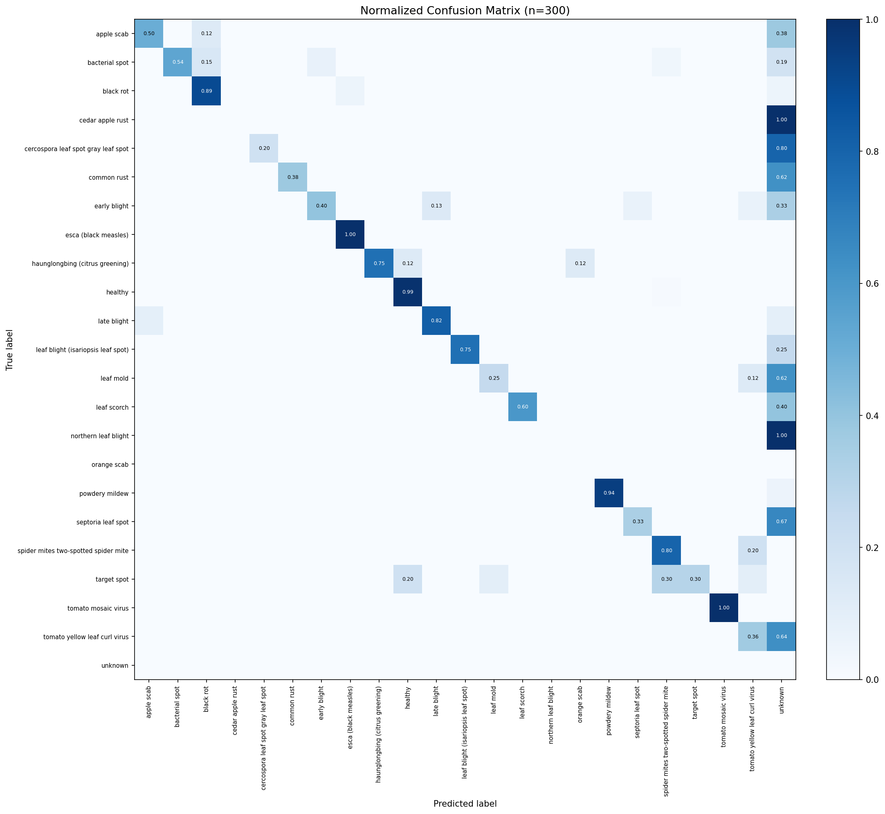

*Figure 9: Row-normalized confusion matrix across all 23 label categories (21 diseases + unknown + one unused). Cell values represent the fraction of true-class samples predicted as each class. Strong diagonal (values near 1.0) indicates correct classification. Off-diagonal mass in the "unknown" column reflects the parse-failure phenomenon.*

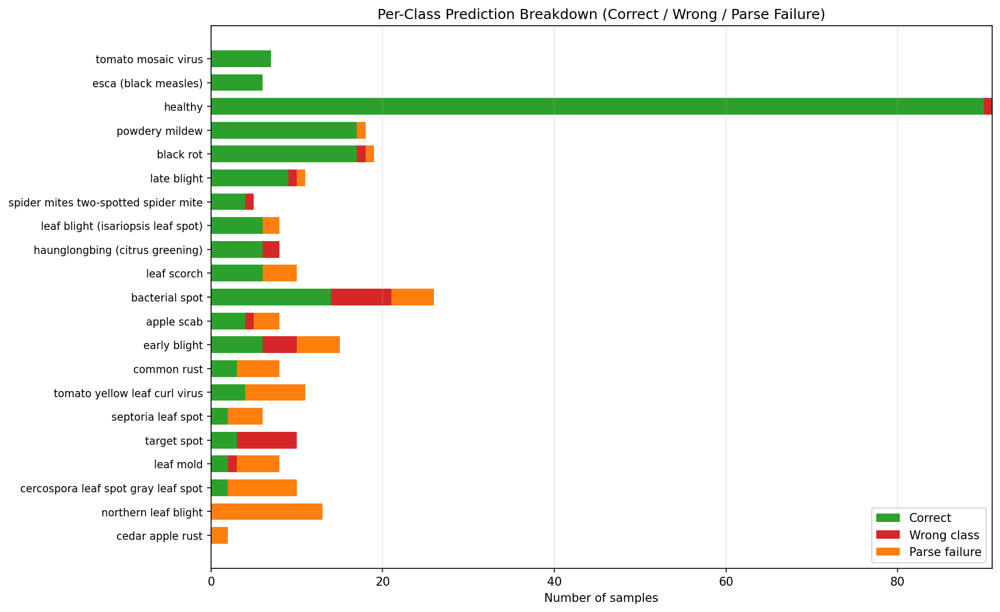

*Figure 11: Per-class prediction breakdown. Green = correct, red = wrong class, orange = parse failure. The long orange bars for northern leaf blight, cercospora leaf spot, and tomato yellow leaf curl virus visualize where the parser fails most often.*

---

## 5. Deployment

### 5.1 Deployment Artifacts

**Table 12: Deployment artifacts**

| File | Purpose | Quantization | Size |
|------|---------|:------------:|-----:|
| `smolvlm-plantvillage-Q4_K_M.gguf` | Main language model | Q4_K_M | ~289–303 MB |
| `mmproj-smolvlm-Q8_0.gguf` | Vision projector | Q8_0 | ~104–109 MB |
| **Total** | — | — | **~393 MB** |

### 5.2 Android (Flutter / mt_llmkit)

```dart
final model = LocalModel(
  config: LlmConfig(
    mmprojPath: 'assets/mmproj-smolvlm-Q8_0.gguf',
    nCtx: 4096,
    nGpuLayers: 0,  // CPU for compatibility
  ),
);
await model.loadModel('assets/smolvlm-plantvillage-Q4_K_M.gguf');

final image = LlamaImageContent(path: '/path/to/leaf.jpg');
model.sendPromptStream(
  'Identify the plant disease in this image.',
  images: [image],
).listen((chunk) { print(chunk.text); });
```

### 5.3 Android (Kotlin / kotlinllamacpp)

```kotlin
llamaHelper.load(
    path = mainModelUri,
    contextLength = 4096,
    mmprojPath = mmprojUri
) { id -> /* Ready */ }

llamaHelper.predict(
    prompt = "Identify the plant disease in this image.",
    imagePath = selectedImageUri
)
```

### 5.4 Prompting Rules

- Pass **only the raw user message**: `Identify the plant disease in this image.`
- **Do not** pass ChatML markers; the runtime applies the model's chat template automatically

### 5.5 Output Parsing

```kotlin
val disease = output.lines()
    .firstOrNull { it.contains("Disease:") }
    ?.substringAfter("Disease:")
    ?.replace("*", "")
    ?.trim()
```

Recommended: treat any output without a parseable disease name as `unknown` and request a retry from the user (see §4.2 — parse failures account for 71% of errors).

### 5.6 Runtime Performance

| Platform | Latency / image | RAM during inference | Network |
|----------|:---------------:|:--------------------:|:-------:|
| Mid-range Android (CPU) | 7–12 s | ~600–800 MB | None |
| CPU-only laptop | 7–15 s | ~600–800 MB | None |

---

## 6. Reproducibility

| Item | Value |
|------|-------|
| Base model | `HuggingFaceTB/SmolVLM-500M-Instruct` |
| Dataset | PlantVillage (38 classes, 4,104 training samples) |
| Fine-tuning | LoRA, r=16, α=32, 9.57M trainable params |
| Quantization | llama.cpp GGUF — Q4_K_M (language model), Q8_0 (projector) |
| Evaluation | 300 held-out samples, temperature 0 decoding |
| Metrics source | `overall_metrics.csv`, `per_class_metrics.csv` |
| Integrity check | `verify_gguf.py` (GGUF structure and metadata validation) |
| Determinism | Fixed image + prompt + decoding params → identical output |

---

## 7. Limitations

- Trained only on PlantVillage-style images (single leaf, controlled background, good lighting); performance on field photos with complex backgrounds, multiple leaves, or poor lighting may drop significantly
- Covers the 38 PlantVillage classes only; not valid for diseases outside this set
- **22% of outputs fail structured parsing (§4.2)** — consumers must handle `unknown`/retry paths; this is the primary known defect targeted for v1.1
- Strong class imbalance and long-tailed validation distribution (§3.3) mean macro metrics (F1 56.36%) trail weighted metrics (F1 73.78%)
- Identifies plant species and disease but **does not provide treatment recommendations**
- Not a substitute for professional agronomic diagnosis

---

## 8. Intended Use

**Primary use:** On-device, offline plant disease triage for farmers, students, and agricultural extension workers via Android apps.

**Out-of-scope use:** Commercial agricultural decisions without expert validation, medical/veterinary advice, safety-critical applications, or any use requiring certified agronomic diagnosis.

---

## 9. Citation

```bibtex
@misc{krishinet_vlm_2026,
  title        = {KrishiNet-VLM-500M-PlantVillage},
  author       = {KrishiNet Team},
  year         = {2026},
  howpublished = {Model Card v1.0}
}
```

---

## 10. Version History

| Version | Date | Changes |
|:-------:|------|---------|
| 1.0 | October 2026 | Initial release: LoRA fine-tune of SmolVLM-500M-Instruct on PlantVillage (4,104 samples), GGUF Q4_K_M + Q8_0 export, end-to-end evaluation on 300 samples (69.33% end-to-end / 88.89% parseable disease accuracy, macro AUC 0.9317) |

---

## 11. Contact

- Project: KrishiNet-VLM
- Issues / feedback: project repository issue tracker

---

## 12. License

Apache License 2.0. See the base model's license (`HuggingFaceTB/SmolVLM-500M-Instruct`) for upstream terms.

